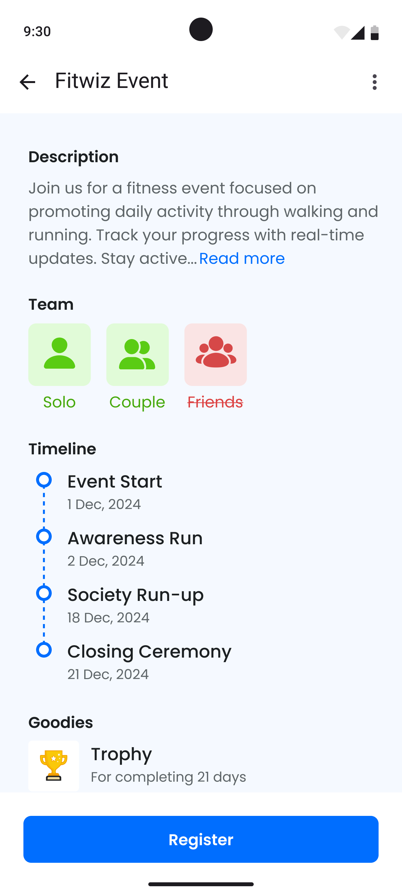
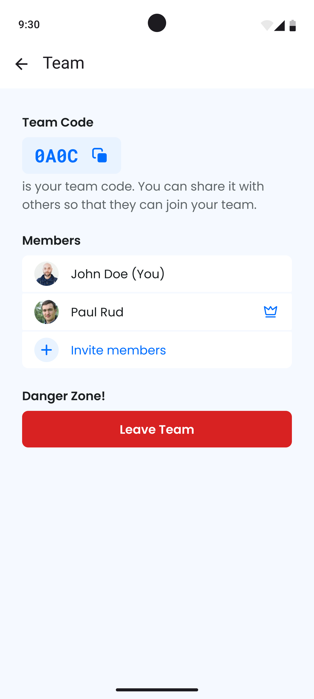

 

# Fitwiz 🌟

*Fitwiz* hosts events which users can participate in, fostering a community of fitness enthusiasts and providing extra motivation to achieve their goals.

## Features 📋

- **Events**: Users can participate in events, which are created by the admin.
- **Teams**: Users can form teams to participate in events together.
- **Daily Activity Tracking**: Log daily activities such as walking and running.
- **Progress Reports**: Generate daily reports to track performance.

## Gallery 🖼️

  
  
  
  

## Play Store Link 📲

Check out the Fitwiz app on the [Play Store](https://play.google.com/store/apps/details?id=com.fit_wiz).

If you want to try the app, you can currently request access from the website: [https://fit-wiz.com](https://fit-wiz.com).

## Getting Started 🚀

1. Clone the repo in your local environment
2. Run `flutter pub get`
3. Finally, run `flutter run`

## License 📜

This project is licensed under the **All Rights Reserved License**. All rights to the source code are reserved by the author. For more details, please refer to the [LICENSE](LICENSE) file.
